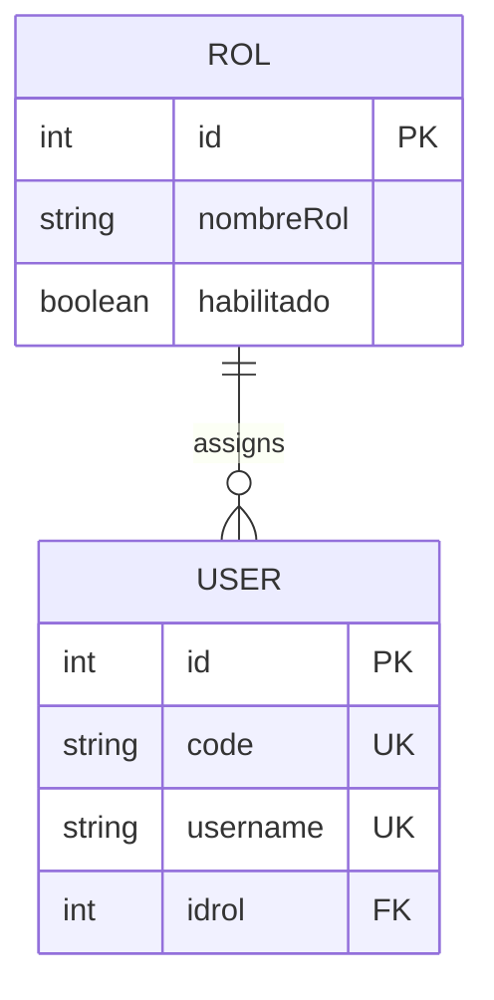

## Overview

The Role-Based Access Control (RBAC) system manages user permissions and access levels within the TechCore API. Every user must be assigned to a role, which determines their capabilities and access rights.

## Role Model

The Role (Rol) model defines permission groups with the following structure:

### Role Fields

| Field | Type | Required | Description |
|-------|------|----------|-------------|
| `id` | integer | Yes | Unique identifier for the role (auto-generated) |
| `nombreRol` | string | Yes | Name of the role (max 100 characters) |
| `habilitado` | boolean | Yes | Whether the role is active (defaults to true) |

### Role Properties

- **Primary Key**: `id`
- **Indexed Field**: `habilitado` for filtering active roles
- **Table Name**: `rol`

## User-Role Relationship

Each user is linked to exactly one role through the `idrol` field:



- **Relationship Type**: Many-to-One (many users can share one role)
- **Foreign Key**: `users.idrol` references `rol.id`
- **Delete Behavior**: Cascade prevention (cannot delete role if users are assigned)
- **Navigation Property**: `IdrolNavigation` in User model, `Users` collection in Rol model

## Role Management Endpoints

### Get All Roles

```http
GET /api/roles
```

Retrieve all roles in the system.

**Query Parameters**

| Parameter | Type | Description |
|-----------|------|-------------|
| `habilitado` | boolean | Filter by enabled/disabled status |

**Response**

```json
{
  "success": true,
  "data": [
    {
      "id": 1,
      "nombreRol": "Administrator",
      "habilitado": true
    },
    {
      "id": 2,
      "nombreRol": "Sales Representative",
      "habilitado": true
    },
    {
      "id": 3,
      "nombreRol": "Inventory Manager",
      "habilitado": true
    }
  ]
}
```

### Get Role by ID

```http
GET /api/roles/{id}
```

Retrieve a specific role by its ID.

**Response**

```json
{
  "success": true,
  "data": {
    "id": 1,
    "nombreRol": "Administrator",
    "habilitado": true,
    "userCount": 5
  }
}
```

### Create Role

```http
POST /api/roles
```

Create a new role.

**Request Body**

```json
{
  "nombreRol": "Customer Service",
  "habilitado": true
}
```

**Response**

```json
{
  "success": true,
  "data": {
    "id": 4,
    "nombreRol": "Customer Service",
    "habilitado": true
  },
  "message": "Role created successfully"
}
```

### Update Role

```http
PUT /api/roles/{id}
```

Update an existing role.

**Request Body**

```json
{
  "nombreRol": "Senior Sales Representative",
  "habilitado": true
}
```

**Response**

```json
{
  "success": true,
  "data": {
    "id": 2,
    "nombreRol": "Senior Sales Representative",
    "habilitado": true
  },
  "message": "Role updated successfully"
}
```

### Enable/Disable Role

```http
PATCH /api/roles/{id}/status
```

Enable or disable a role without deleting it.

**Request Body**

```json
{
  "habilitado": false
}
```

**Response**

```json
{
  "success": true,
  "message": "Role status updated successfully"
}
```

<Warning>
  Disabling a role does not automatically revoke access for users assigned to that role. Implement additional logic to handle user sessions when their role is disabled.
</Warning>

### Get Users by Role

```http
GET /api/roles/{id}/users
```

Retrieve all users assigned to a specific role.

**Response**

```json
{
  "success": true,
  "data": [
    {
      "id": 1,
      "code": "USR001",
      "nombre": "John Doe",
      "username": "john.doe",
      "email": "john.doe@example.com",
      "phone": "+1234567890",
      "idrol": 2,
      "created_date": "2024-01-15T10:30:00Z"
    },
    {
      "id": 5,
      "code": "USR005",
      "nombre": "Jane Smith",
      "username": "jane.smith",
      "email": "jane.smith@example.com",
      "phone": "+1234567891",
      "idrol": 2,
      "created_date": "2024-02-10T14:20:00Z"
    }
  ],
  "count": 2
}
```

## Common Role Types

Typical roles in a sales management system:

### Administrator
- Full system access
- User management
- Role management
- System configuration
- All transaction types

### Sales Representative
- Create and manage sales (ventas)
- View customer information
- Process payments
- Limited inventory access

### Inventory Manager
- Create and manage purchases (compras)
- Manage products and categories
- Update stock levels
- View supplier information

### Accountant
- View sales and purchase reports
- Manage payment plans
- Process customer payments
- Generate financial reports

## Role Assignment

### Assigning Role to User

When creating or updating users, specify the role ID:

```json
{
  "code": "USR010",
  "nombre": "Alice Johnson",
  "username": "alice.johnson",
  "pwd": "hashedPassword",
  "email": "alice@example.com",
  "idrol": 2
}
```

### Changing User Role

```http
PUT /api/users/{id}
```

**Request Body**

```json
{
  "idrol": 3
}
```

<Note>
  When changing a user's role, consider implementing a session invalidation mechanism to force re-authentication with new permissions.
</Note>

## Best Practices

### Role Design

1. **Principle of Least Privilege**: Assign minimum necessary permissions
2. **Role Granularity**: Create specific roles rather than overly broad ones
3. **Disabled vs. Deleted**: Disable roles instead of deleting to preserve audit trails
4. **Regular Audits**: Periodically review role assignments and permissions

### Security Considerations

<Warning>
  **Important Security Measures:**
  - Validate role existence before assignment
  - Check `habilitado` status before granting access
  - Log all role changes for audit purposes
  - Prevent deletion of roles with assigned users
</Warning>

### Database Integrity

- **Foreign Key Constraint**: The `users.idrol` field references `rol.id` with ClientSetNull delete behavior
- **Index on habilitado**: Optimizes queries filtering by role status
- **Required Fields**: Both `nombreRol` and `habilitado` are required

## Error Handling

### Common Role Errors

| Status Code | Error | Description |
|-------------|-------|-------------|
| 400 | Bad Request | Invalid role data |
| 403 | Forbidden | Insufficient permissions to manage roles |
| 404 | Not Found | Role does not exist |
| 409 | Conflict | Cannot delete role with assigned users |
| 422 | Validation Error | Missing required fields |

### Example Error Response

```json
{
  "success": false,
  "error": "Cannot delete role",
  "message": "Role 'Sales Representative' has 15 assigned users. Please reassign users before deletion.",
  "code": 409
}
```

## Data Relationships

The role system connects to:

- **Users**: One role can be assigned to multiple users
- **Compras**: Users (with roles) create purchase orders
- **Ventas**: Users (with roles) process sales transactions

This allows for granular permission control across all business operations.

## Related Resources

<CardGroup cols={2}>
  <Card title="User Overview" icon="user" href="/api/users/overview">
    Learn about user management
  </Card>
  <Card title="Authentication" icon="lock" href="/api/users/authentication">
    Explore authentication and security
  </Card>
</CardGroup>