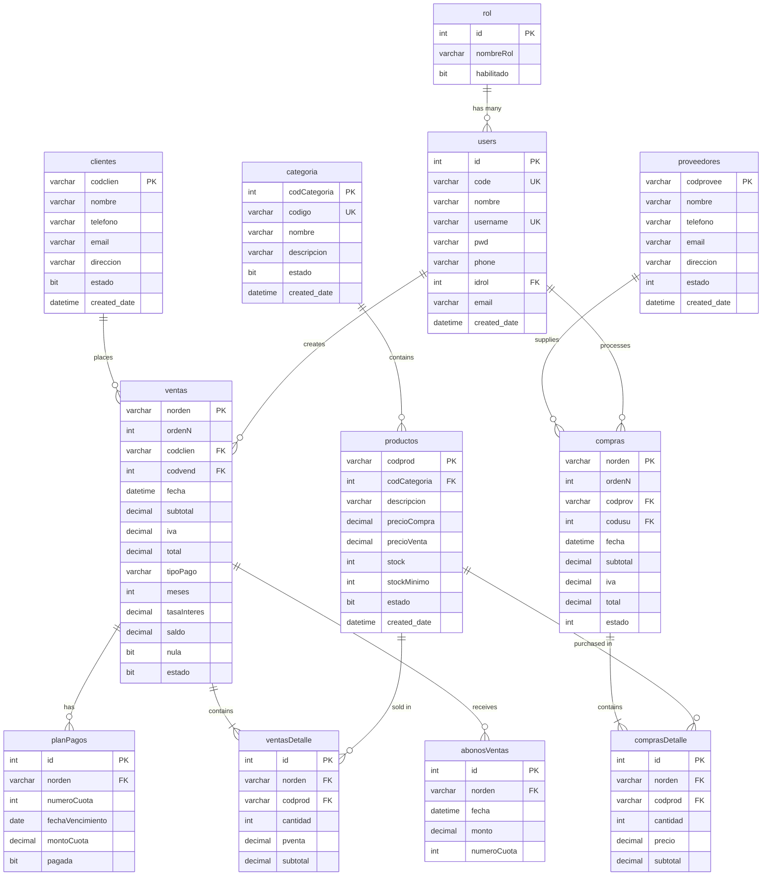

## Database Schema Overview

TechCore uses a normalized relational database built on SQL Server. The schema supports sales operations, inventory management, purchasing, and credit management.

## Entity Relationship Diagram



## Core Entities

### User Management

#### Rol

Defines user roles and permissions.

**Model Location**: Models/Models/Rol.cs

<Expandable title="Entity Properties">
```csharp
public partial class Rol
{
    public int Id { get; set; }
    public string NombreRol { get; set; } = null!;
    public bool? Habilitado { get; set; }
    
    // Navigation Properties
    public virtual ICollection<User> Users { get; set; }
}
```
</Expandable>

<Accordion title="Database Configuration">
  - **Primary Key**: `id` (Identity)
  - **Indexes**: `IDX_rol_habilitado`
  - **Defaults**: `habilitado = 1`
  
  **Context Configuration**: TechSalesContext.cs:364-380
</Accordion>

#### User

System users with role-based access.

**Model Location**: Models/Models/User.cs:6-31

<Expandable title="Entity Properties">
```csharp
public partial class User
{
    public int Id { get; set; }
    public string Code { get; set; } = null!;      // Unique employee code
    public string Nombre { get; set; } = null!;
    public string Username { get; set; } = null!;  // Unique login
    public string Pwd { get; set; } = null!;       // Password hash
    public string? Phone { get; set; }
    public int Idrol { get; set; }                 // Foreign key to Rol
    public string? Email { get; set; }
    public DateTime? CreatedDate { get; set; }
    
    // Navigation Properties
    public virtual Rol IdrolNavigation { get; set; } = null!;
    public virtual ICollection<Compra> Compras { get; set; }
    public virtual ICollection<Venta> Venta { get; set; }
}
```
</Expandable>

<Accordion title="Database Configuration">
  - **Primary Key**: `id` (Identity)
  - **Unique Constraints**: `code`, `username`
  - **Indexes**: `IDX_users_code`, `IDX_users_email`, `IDX_users_idrol`
  - **Foreign Keys**: `idrol` → `rol(id)`
  - **Defaults**: `created_date = GETDATE()`
  
  **Context Configuration**: TechSalesContext.cs:382-430
</Accordion>

### Customer Management

#### Cliente

Customer master data.

**Model Location**: Models/Models/Cliente.cs:6-23

<Expandable title="Entity Properties">
```csharp
public partial class Cliente
{
    public string Codclien { get; set; } = null!;  // Customer code (PK)
    public string Nombre { get; set; } = null!;
    public string? Telefono { get; set; }
    public string? Email { get; set; }
    public string? Direccion { get; set; }
    public bool? Estado { get; set; }              // Active/Inactive
    public DateTime? CreatedDate { get; set; }
    
    // Navigation Properties
    public virtual ICollection<Venta> Venta { get; set; }
}
```
</Expandable>

<Accordion title="Database Configuration">
  - **Primary Key**: `codclien` (VARCHAR(50))
  - **Indexes**: `IDX_clientes_nombre`, `IDX_clientes_estado`, `IDX_clientes_email`
  - **Defaults**: `estado = 1`, `created_date = GETDATE()`
  
  **Context Configuration**: TechSalesContext.cs:116-155
</Accordion>

### Product Catalog

#### Categorium

Product categories for organization.

**Model Location**: Models/Models/Categorium.cs

<Expandable title="Entity Properties">
```csharp
public partial class Categorium
{
    public int CodCategoria { get; set; }           // Auto-increment PK
    public string Codigo { get; set; } = null!;     // Unique category code
    public string Nombre { get; set; } = null!;
    public string? Descripcion { get; set; }
    public bool? Estado { get; set; }
    public DateTime? CreatedDate { get; set; }
    
    // Navigation Properties
    public virtual ICollection<Producto> Productos { get; set; }
}
```
</Expandable>

<Accordion title="Database Configuration">
  - **Primary Key**: `codCategoria` (Identity)
  - **Unique Constraints**: `codigo`
  - **Indexes**: `IDX_categoria_codigo`, `IDX_categoria_nombre`, `IDX_categoria_estado`
  - **Defaults**: `estado = 1`, `created_date = GETDATE()`
  
  **Context Configuration**: TechSalesContext.cs:80-114
</Accordion>

#### Producto

Product master with inventory tracking.

**Model Location**: Models/Models/Producto.cs:6-31

<Expandable title="Entity Properties">
```csharp
public partial class Producto
{
    public string Codprod { get; set; } = null!;    // Product code (PK)
    public int? CodCategoria { get; set; }          // FK to Categorium
    public string? Descripcion { get; set; }
    public decimal PrecioCompra { get; set; }       // Purchase price
    public decimal PrecioVenta { get; set; }        // Sales price
    public int? Stock { get; set; }                 // Current stock level
    public int? StockMinimo { get; set; }           // Reorder threshold
    public bool? Estado { get; set; }
    public DateTime? CreatedDate { get; set; }
    
    // Navigation Properties
    public virtual Categorium? CodCategoriaNavigation { get; set; }
    public virtual ICollection<ComprasDetalle> ComprasDetalles { get; set; }
    public virtual ICollection<VentasDetalle> VentasDetalles { get; set; }
}
```
</Expandable>

<Accordion title="Database Configuration">
  - **Primary Key**: `codprod` (VARCHAR(50))
  - **Foreign Keys**: `codCategoria` → `categoria(codCategoria)`
  - **Indexes**: `IDX_productos_descripcion`, `IDX_productos_idcategoria`, `IDX_productos_estado`, `IDX_productos_stock`
  - **Defaults**: `stock = 0`, `stockMinimo = 5`, `estado = 1`
  - **Composite Index**: `(stock, stockMinimo)` for low-stock alerts
  
  **Context Configuration**: TechSalesContext.cs:277-323
</Accordion>

### Sales Management

#### Venta

Sales order header with payment terms.

**Model Location**: Models/Models/Venta.cs:6-45

<Expandable title="Entity Properties">
```csharp
public partial class Venta
{
    public string Norden { get; set; } = null!;     // Order number (PK)
    public int OrdenN { get; set; }                 // Sequential number
    public string Codclien { get; set; } = null!;   // FK to Cliente
    public int Codvend { get; set; }                // FK to User (seller)
    public DateTime? Fecha { get; set; }
    
    // Financial Details
    public decimal Subtotal { get; set; }
    public decimal Iva { get; set; }                // Tax amount
    public decimal Total { get; set; }
    
    // Payment Terms
    public string? TipoPago { get; set; }           // "CONTADO" or "CREDITO"
    public int? Meses { get; set; }                 // Installment months
    public decimal? TasaInteres { get; set; }       // Interest rate
    public decimal Saldo { get; set; }              // Remaining balance
    
    // Status
    public bool? Nula { get; set; }                 // Voided flag
    public bool? Estado { get; set; }               // Active flag
    
    // Navigation Properties
    public virtual Cliente CodclienNavigation { get; set; } = null!;
    public virtual User CodvendNavigation { get; set; } = null!;
    public virtual ICollection<VentasDetalle> VentasDetalles { get; set; }
    public virtual ICollection<PlanPago> PlanPagos { get; set; }
    public virtual ICollection<AbonosVenta> AbonosVenta { get; set; }
}
```
</Expandable>

<Accordion title="Database Configuration">
  - **Primary Key**: `norden` (VARCHAR(50))
  - **Foreign Keys**: `codclien` → `clientes(codclien)`, `codvend` → `users(id)`
  - **Indexes**: `IDX_ventas_codclien`, `IDX_ventas_codvend`, `IDX_ventas_fecha`, `IDX_ventas_tipoPago`
  - **Filtered Index**: `IDX_ventas_nula WHERE nula = 0` (active sales only)
  - **Defaults**: `fecha = GETDATE()`, `tipoPago = 'CONTADO'`, `tasaInteres = 0`, `nula = 0`, `estado = 1`
  
  **Context Configuration**: TechSalesContext.cs:432-500
</Accordion>

#### VentasDetalle

Sales order line items.

**Model Location**: Models/Models/VentasDetalle.cs

<Expandable title="Entity Properties">
```csharp
public partial class VentasDetalle
{
    public int Id { get; set; }                     // Auto-increment PK
    public string Norden { get; set; } = null!;     // FK to Venta
    public string Codprod { get; set; } = null!;    // FK to Producto
    public int Cantidad { get; set; }               // Quantity sold
    public decimal Pventa { get; set; }             // Unit price
    public decimal Subtotal { get; set; }           // Line total
    
    // Navigation Properties
    public virtual Venta NordenNavigation { get; set; } = null!;
    public virtual Producto CodprodNavigation { get; set; } = null!;
}
```
</Expandable>

<Accordion title="Database Configuration">
  - **Primary Key**: `id` (Identity)
  - **Foreign Keys**: 
    - `norden` → `ventas(norden)` ON DELETE CASCADE
    - `codprod` → `productos(codprod)`
  - **Indexes**: `IDX_ventasDetalle_norden`, `IDX_ventasDetalle_codprod`
  - **Trigger**: `TR_DisminuirStock` - Reduces product stock on insert
  
  **Context Configuration**: TechSalesContext.cs:502-537
</Accordion>

### Credit Management

#### PlanPago

Installment payment schedule.

**Model Location**: Models/Models/PlanPago.cs:6-21

<Expandable title="Entity Properties">
```csharp
public partial class PlanPago
{
    public int Id { get; set; }                     // Auto-increment PK
    public string Norden { get; set; } = null!;     // FK to Venta
    public int NumeroCuota { get; set; }            // Installment number
    public DateOnly FechaVencimiento { get; set; }  // Due date
    public decimal MontoCuota { get; set; }         // Installment amount
    public bool? Pagada { get; set; }               // Payment status
    
    // Navigation Properties
    public virtual Venta NordenNavigation { get; set; } = null!;
}
```
</Expandable>

<Accordion title="Database Configuration">
  - **Primary Key**: `id` (Identity)
  - **Foreign Keys**: `norden` → `ventas(norden)` ON DELETE CASCADE
  - **Indexes**: `IDX_planPagos_norden`, `IDX_planPagos_fechaVencimiento`
  - **Filtered Index**: `IDX_planPagos_pagada WHERE pagada = 0` (unpaid only)
  - **Defaults**: `pagada = 0`
  
  **Context Configuration**: TechSalesContext.cs:246-275
</Accordion>

#### AbonosVenta

Payment transactions against installments.

**Model Location**: Models/Models/AbonosVenta.cs:6-19

<Expandable title="Entity Properties">
```csharp
public partial class AbonosVenta
{
    public int Id { get; set; }                     // Auto-increment PK
    public string Norden { get; set; } = null!;     // FK to Venta
    public DateTime? Fecha { get; set; }            // Payment date
    public decimal Monto { get; set; }              // Payment amount
    public int NumeroCuota { get; set; }            // Installment number paid
    
    // Navigation Properties
    public virtual Venta NordenNavigation { get; set; } = null!;
}
```
</Expandable>

<Accordion title="Database Configuration">
  - **Primary Key**: `id` (Identity)
  - **Foreign Keys**: `norden` → `ventas(norden)` ON DELETE CASCADE
  - **Indexes**: `IDX_abonosVentas_norden`, `IDX_abonosVentas_fecha`
  - **Defaults**: `fecha = GETDATE()`
  - **Trigger**: `TR_ActualizarSaldo` - Updates sale balance and marks installment paid
  
  **Context Configuration**: TechSalesContext.cs:51-78
</Accordion>

### Purchase Management

#### Proveedore

Supplier master data.

**Model Location**: Models/Models/Proveedore.cs

<Expandable title="Entity Properties">
```csharp
public partial class Proveedore
{
    public string Codprovee { get; set; } = null!;  // Supplier code (PK)
    public string Nombre { get; set; } = null!;
    public string? Telefono { get; set; }
    public string? Email { get; set; }
    public string? Direccion { get; set; }
    public int? Estado { get; set; }                // Status
    public DateTime? CreatedDate { get; set; }
    
    // Navigation Properties
    public virtual ICollection<Compra> Compras { get; set; }
}
```
</Expandable>

<Accordion title="Database Configuration">
  - **Primary Key**: `codprovee` (VARCHAR(50))
  - **Indexes**: `IDX_proveedores_nombre`, `IDX_proveedores_estado`
  - **Defaults**: `estado = 1`, `created_date = GETDATE()`
  
  **Context Configuration**: TechSalesContext.cs:325-362
</Accordion>

#### Compra

Purchase order header.

**Model Location**: Models/Models/Compra.cs:6-31

<Expandable title="Entity Properties">
```csharp
public partial class Compra
{
    public string Norden { get; set; } = null!;     // Order number (PK)
    public int OrdenN { get; set; }                 // Sequential number
    public string Codprov { get; set; } = null!;    // FK to Proveedore
    public int Codusu { get; set; }                 // FK to User
    public DateTime? Fecha { get; set; }
    public decimal Subtotal { get; set; }
    public decimal Iva { get; set; }
    public decimal Total { get; set; }
    public int? Estado { get; set; }
    
    // Navigation Properties
    public virtual Proveedore CodprovNavigation { get; set; } = null!;
    public virtual User CodusuNavigation { get; set; } = null!;
    public virtual ICollection<ComprasDetalle> ComprasDetalles { get; set; }
}
```
</Expandable>

<Accordion title="Database Configuration">
  - **Primary Key**: `norden` (VARCHAR(50))
  - **Foreign Keys**: `codprov` → `proveedores(codprovee)`, `codusu` → `users(id)`
  - **Indexes**: `IDX_compras_codprov`, `IDX_compras_codusu`, `IDX_compras_fecha`, `IDX_compras_estado`
  - **Defaults**: `fecha = GETDATE()`, `estado = 1`
  
  **Context Configuration**: TechSalesContext.cs:157-207
</Accordion>

#### ComprasDetalle

Purchase order line items.

**Model Location**: Models/Models/ComprasDetalle.cs

<Expandable title="Entity Properties">
```csharp
public partial class ComprasDetalle
{
    public int Id { get; set; }                     // Auto-increment PK
    public string Norden { get; set; } = null!;     // FK to Compra
    public string Codprod { get; set; } = null!;    // FK to Producto
    public int Cantidad { get; set; }               // Quantity purchased
    public decimal Precio { get; set; }             // Unit cost
    public decimal Subtotal { get; set; }           // Line total
    
    // Navigation Properties
    public virtual Compra NordenNavigation { get; set; } = null!;
    public virtual Producto CodprodNavigation { get; set; } = null!;
}
```
</Expandable>

<Accordion title="Database Configuration">
  - **Primary Key**: `id` (Identity)
  - **Foreign Keys**: 
    - `norden` → `compras(norden)` ON DELETE CASCADE
    - `codprod` → `productos(codprod)`
  - **Indexes**: `IDX_comprasDetalle_norden`, `IDX_comprasDetalle_codprod`
  
  **Context Configuration**: TechSalesContext.cs:209-244
</Accordion>

## Database Views

Pre-computed views for reporting and analysis.

### VwCuotasVencida

Overdue installments with penalty calculations.

**Model Location**: Models/Models/VwCuotasVencida.cs

<Expandable title="View Properties">
```csharp
public partial class VwCuotasVencida
{
    public string Norden { get; set; }              // Sale order number
    public string Cliente { get; set; }             // Customer name
    public int NumeroCuota { get; set; }            // Installment number
    public DateOnly FechaVencimiento { get; set; }  // Due date
    public decimal MontoCuota { get; set; }         // Installment amount
    public int DiasAtraso { get; set; }             // Days overdue
    public decimal? MoraCalculada { get; set; }     // Late fee (2% per day)
}
```
</Expandable>

<Accordion title="SQL Definition">
  **Location**: TechSalesQuery.sql:381-397
  
  Filters:
  - Unpaid installments (`pagada = 0`)
  - Past due date (`fechaVencimiento < GETDATE()`)
  - Active sales only (`nula = 0`)
  
  Calculation: `moraCalculada = montoCuota * 0.02 * DATEDIFF(DAY, fechaVencimiento, GETDATE())`
  
  **Context Configuration**: TechSalesContext.cs:560-583
</Accordion>

### VwCuotasPorVencer

Upcoming installment due dates.

**Model Location**: Models/Models/VwCuotasPorVencer.cs

<Expandable title="View Properties">
```csharp
public partial class VwCuotasPorVencer
{
    public string Norden { get; set; }              // Sale order number
    public string Cliente { get; set; }             // Customer name
    public int NumeroCuota { get; set; }            // Installment number
    public DateOnly FechaVencimiento { get; set; }  // Due date
    public decimal MontoCuota { get; set; }         // Installment amount
}
```
</Expandable>

<Accordion title="SQL Definition">
  **Location**: TechSalesQuery.sql:402-416
  
  Filters:
  - Unpaid installments (`pagada = 0`)
  - Future or today due date (`fechaVencimiento >= GETDATE()`)
  - Active sales only (`nula = 0`)
  
  **Context Configuration**: TechSalesContext.cs:539-558
</Accordion>

### VwEstadoCuentum

Customer account statements.

**Model Location**: Models/Models/VwEstadoCuentum.cs

<Expandable title="View Properties">
```csharp
public partial class VwEstadoCuentum
{
    public string Norden { get; set; }              // Sale order number
    public string Cliente { get; set; }             // Customer name
    public decimal Total { get; set; }              // Total sale amount
    public decimal Saldo { get; set; }              // Remaining balance
    public int? Meses { get; set; }                 // Payment term (months)
    public decimal? TotalAbonado { get; set; }      // Total paid to date
}
```
</Expandable>

<Accordion title="SQL Definition">
  **Location**: TechSalesQuery.sql:421-436
  
  Filters:
  - Credit sales only (`tipoPago = 'CREDITO'`)
  - Active sales only (`nula = 0`)
  
  Aggregates payment history with LEFT JOIN to abonosVentas
  
  **Context Configuration**: TechSalesContext.cs:585-609
</Accordion>

## Database Triggers

### TR_DisminuirStock

Automatically reduces product stock when sales are completed.

<CodeGroup>
```sql SQL Definition
CREATE TRIGGER TR_DisminuirStock
ON ventasDetalle
AFTER INSERT
AS
BEGIN
    UPDATE p
    SET p.stock = p.stock - i.cantidad
    FROM productos p
    INNER JOIN inserted i ON p.codprod = i.codprod
    INNER JOIN ventas v ON v.norden = i.norden
    WHERE v.nula = 0  -- Only for non-voided sales
END
```
</CodeGroup>

**Location**: TechSalesQuery.sql:338-352

**Applied to**: ventasDetalle table

**Configuration**: TechSalesContext.cs:506

### TR_ActualizarSaldo

Updates sale balance and marks installments as paid when payments are recorded.

<CodeGroup>
```sql SQL Definition
CREATE TRIGGER TR_ActualizarSaldo
ON abonosVentas
AFTER INSERT
AS
BEGIN
    -- Update sale balance
    UPDATE v
    SET v.saldo = v.saldo - i.monto
    FROM ventas v
    INNER JOIN inserted i ON v.norden = i.norden
    
    -- Mark installment as paid
    UPDATE pp
    SET pagada = 1
    FROM planPagos pp
    INNER JOIN inserted i 
        ON pp.norden = i.norden 
        AND pp.numeroCuota = i.numeroCuota
END
```
</CodeGroup>

**Location**: TechSalesQuery.sql:357-374

**Applied to**: abonosVentas table

**Configuration**: TechSalesContext.cs:55

## Indexing Strategy

Comprehensive indexing for query optimization:

### Primary Access Patterns

<AccordionGroup>
  <Accordion title="Customer Lookups">
    - `IDX_clientes_nombre` - Search by customer name
    - `IDX_clientes_email` - Search by email
    - `IDX_clientes_estado` - Filter active customers
  </Accordion>
  
  <Accordion title="Product Searches">
    - `IDX_productos_descripcion` - Search by description
    - `IDX_productos_idcategoria` - Filter by category
    - `IDX_productos_estado` - Filter active products
    - `IDX_productos_stock` - Low stock alerts (composite: stock, stockMinimo)
  </Accordion>
  
  <Accordion title="Sales Queries">
    - `IDX_ventas_codclien` - Customer's sales history
    - `IDX_ventas_codvend` - Seller's performance
    - `IDX_ventas_fecha` - Date range queries
    - `IDX_ventas_tipoPago` - Filter by payment type
    - `IDX_ventas_nula WHERE nula = 0` - Active sales only (filtered)
  </Accordion>
  
  <Accordion title="Credit Management">
    - `IDX_planPagos_norden` - Installments by sale
    - `IDX_planPagos_fechaVencimiento` - Due date queries
    - `IDX_planPagos_pagada WHERE pagada = 0` - Unpaid installments (filtered)
    - `IDX_abonosVentas_norden` - Payment history
    - `IDX_abonosVentas_fecha` - Payment date queries
  </Accordion>
  
  <Accordion title="Purchase Operations">
    - `IDX_compras_codprov` - Supplier's purchase history
    - `IDX_compras_codusu` - User's purchase orders
    - `IDX_compras_fecha` - Date range queries
    - `IDX_compras_estado` - Filter by status
  </Accordion>
</AccordionGroup>

### Filtered Indexes

Optimized indexes with WHERE clauses:

```sql
-- Only index active sales (most common query)
CREATE INDEX IDX_ventas_nula ON ventas(nula) WHERE nula = 0

-- Only index unpaid installments (for collection reports)
CREATE INDEX IDX_planPagos_pagada ON planPagos(pagada) WHERE pagada = 0
```

## Data Types

### Decimal Precision

Financial fields use `DECIMAL(18,2)` for precision:
- Subtotal, IVA, Total
- PrecioCompra, PrecioVenta
- MontoCuota, Monto
- Saldo

Interest rates use `DECIMAL(5,2)` for percentage values.

### String Fields

VARCHAR (not Unicode) for performance:
- Codes: 10-50 characters
- Names: 100-200 characters
- Descriptions: 300-500 characters
- Passwords: VARCHAR(MAX) for hashing

### Date/Time Fields

- `DATETIME` for timestamps (created_date, fecha)
- `DATE` for due dates (fechaVencimiento)
- EF Core maps to `DateTime?` and `DateOnly`

## Cascade Behaviors

### ON DELETE CASCADE

Automatic deletion of child records:

- `ventas` → `ventasDetalle` (delete line items with order)
- `ventas` → `planPagos` (delete payment plan with order)
- `ventas` → `abonosVentas` (delete payments with order)
- `compras` → `comprasDetalle` (delete line items with purchase)

### Restrict Delete

Prevent deletion of referenced records:

- `clientes` → `ventas` (cannot delete customer with sales)
- `productos` → `ventasDetalle` (cannot delete product with sales history)
- `usuarios` → `ventas` (cannot delete user with sales)
- `rol` → `users` (cannot delete role in use)

## Next Steps

<CardGroup cols={2}>
  <Card title="System Architecture" icon="sitemap" href="/architecture/overview">
    Understand the overall system design
  </Card>
  <Card title="Project Structure" icon="folder-tree" href="/architecture/project-structure">
    Explore the layered architecture
  </Card>
</CardGroup>
