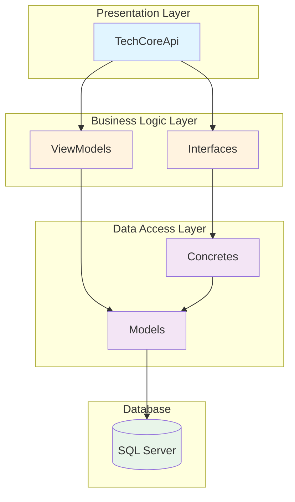
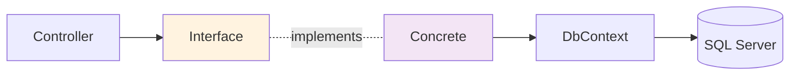

## Overview

TechCore API is a comprehensive sales management system built with .NET Core 10 and SQL Server. The system handles sales operations, inventory management, purchasing, and credit management with installment payment tracking.

## Technology Stack

<CardGroup cols={2}>
  <Card title="Backend Framework" icon="code">
    .NET Core 10 Web API with ASP.NET Core
  </Card>
  <Card title="ORM" icon="database">
    Entity Framework Core 10.0.3
  </Card>
  <Card title="Database" icon="server">
    Microsoft SQL Server
  </Card>
  <Card title="API Documentation" icon="book">
    Swagger/OpenAPI, Scalar API Reference
  </Card>
</CardGroup>

## Architecture Overview

TechCore API follows a clean, layered architecture pattern that separates concerns and promotes maintainability.



## Project Structure

The solution is organized into five distinct projects, each with a specific responsibility:

### TechCoreApi

The main API project that hosts the web application.

<Expandable title="Key Components">
  - **Controllers**: RESTful API endpoints
  - **Program.cs**: Application startup and configuration
  - **Middleware**: CORS, routing, error handling
  - **Dependency Injection**: Service registration
</Expandable>

**Key Configuration** (Program.cs:5-81):

```csharp
// Entity Framework DbContext
builder.Services.AddDbContext<TechSalesContext>(options =>
{
    var connectionString = builder.Configuration.GetConnectionString("DefaultConnection");
    options.UseSqlServer(connectionString);
});

// CORS Policy
builder.Services.AddCors(options => {
    options.AddPolicy("MyAllorOrigins", policy =>
    {
        policy.AllowAnyOrigin().AllowAnyHeader().AllowAnyMethod();
    });
});

// API Documentation
builder.Services.AddOpenApi();
builder.Services.AddSwaggerGen();
```

### Models

Contains entity classes that map to database tables.

<Expandable title="Entity Models">
  - **Cliente**: Customer information
  - **Producto**: Product catalog
  - **Categorium**: Product categories
  - **Venta**: Sales orders
  - **VentasDetalle**: Sales line items
  - **Compra**: Purchase orders
  - **ComprasDetalle**: Purchase line items
  - **User**: System users
  - **Rol**: User roles
  - **Proveedore**: Suppliers
  - **PlanPago**: Payment plans
  - **AbonosVenta**: Payment installments
  - **Database Views**: VwCuotasPorVencer, VwCuotasVencida, VwEstadoCuentum
</Expandable>

### Concretes

Implements the data access layer and repository patterns.

<Expandable title="Data Access Components">
  - **TechSalesContext**: EF Core DbContext with entity configurations
  - **Repository Implementations**: Concrete classes implementing business logic
  - **Data Operations**: CRUD operations and business rules
</Expandable>

### Interfaces

Defines contracts for service implementations.

<Expandable title="Interface Contracts">
  - Service interfaces defining business operations
  - Repository interfaces for data access
  - Promotes dependency injection and testability
</Expandable>

### ViewModels

Data Transfer Objects (DTOs) for API communication.

<Expandable title="DTO Usage">
  - Request/Response models
  - Data transformation and validation
  - Decouples API contracts from database models
</Expandable>

## Design Patterns

### Repository Pattern

The application uses the Repository pattern to abstract data access logic.



### Dependency Injection

Services are registered in Program.cs and injected via constructors:

```csharp
// Service Registration
builder.Services.AddDbContext<TechSalesContext>(options => 
    options.UseSqlServer(connectionString));

// Controllers receive dependencies via constructor
public class SalesController : ControllerBase
{
    private readonly TechSalesContext _context;
    
    public SalesController(TechSalesContext context)
    {
        _context = context;
    }
}
```

### Entity Framework Core

EF Core provides:
- **Code-First Migrations**: Database schema management
- **LINQ Queries**: Type-safe database queries
- **Change Tracking**: Automatic update detection
- **Relationships**: Navigation properties between entities

## Database Integration

The application uses Entity Framework Core with the following approach:

<Steps>
  <Step title="Database-First Approach">
    Models are scaffolded from existing SQL Server database using `Scaffold-DbContext`
  </Step>
  
  <Step title="DbContext Configuration">
    TechSalesContext (Concretes/Data/TechSalesContext.cs:8-615) contains all entity configurations
  </Step>
  
  <Step title="Fluent API Configuration">
    OnModelCreating method defines relationships, indexes, and constraints
  </Step>
  
  <Step title="Connection String">
    Database connection configured in appsettings.json and registered in Program.cs
  </Step>
</Steps>

## API Features

### CORS Support

Configured to allow cross-origin requests from any domain:

```csharp
policy.AllowAnyOrigin()
      .AllowAnyHeader()
      .AllowAnyMethod();
```

### API Documentation

Multiple documentation tools:
- **Swagger UI**: Interactive API testing at `/swagger`
- **OpenAPI**: Standard API specification
- **Scalar**: Modern API reference at `/scalar/v1`

### Auto-Redirect

Root URL (`/`) automatically redirects to Swagger UI (Program.cs:45-56)

## Business Logic

### Sales Operations

- Cash and credit sales support
- Installment payment plans
- Interest rate calculations
- Payment tracking and balance management

### Inventory Management

- Stock tracking with minimum thresholds
- Automatic stock updates via triggers
- Category-based product organization

### Purchase Management

- Supplier management
- Purchase order processing
- Automatic stock replenishment

### Credit Management

- Payment plan generation
- Installment tracking
- Overdue payment monitoring
- Late payment penalties (2% per day)

## Database Triggers

The system uses SQL triggers for critical business rules:

<Accordion title="TR_DisminuirStock">
  Automatically reduces product stock when sales are completed (only for non-voided sales)
  
  **Location**: TechSalesQuery.sql:338-352
</Accordion>

<Accordion title="TR_ActualizarSaldo">
  Updates sale balance and marks installments as paid when payments are recorded
  
  **Location**: TechSalesQuery.sql:355-374
</Accordion>

## Performance Optimizations

### Database Indexing

Extensive indexing strategy for common queries:

- **Filtered Indexes**: For active/non-voided records
- **Composite Indexes**: For multi-column queries
- **Unique Indexes**: For business keys

**Examples**:
```sql
CREATE INDEX IDX_ventas_nula ON ventas(nula) WHERE nula = 0
CREATE INDEX IDX_planPagos_pagada ON planPagos(pagada) WHERE pagada = 0
CREATE INDEX IDX_productos_stock ON productos(stock, stockMinimo)
```

### Database Views

Pre-computed views for complex queries:

- **vw_CuotasVencidas**: Overdue installments with penalty calculations
- **vw_CuotasPorVencer**: Upcoming payment due dates
- **vw_EstadoCuenta**: Customer account statements

## Error Handling

<Note>
  Error handling implementation details should be added as controllers are developed.
</Note>

## Security Considerations

<Warning>
  The current CORS policy allows all origins. Consider restricting this in production.
</Warning>

### Authentication & Authorization

- User/Role based access control structure in place
- Authentication middleware should be implemented
- Password hashing required for User.Pwd field

## Next Steps

<CardGroup cols={2}>
  <Card title="Data Models" icon="shapes" href="/architecture/data-models">
    Explore entity relationships and database schema
  </Card>
  <Card title="Project Structure" icon="folder-tree" href="/architecture/project-structure">
    Detailed breakdown of each project layer
  </Card>
</CardGroup>
