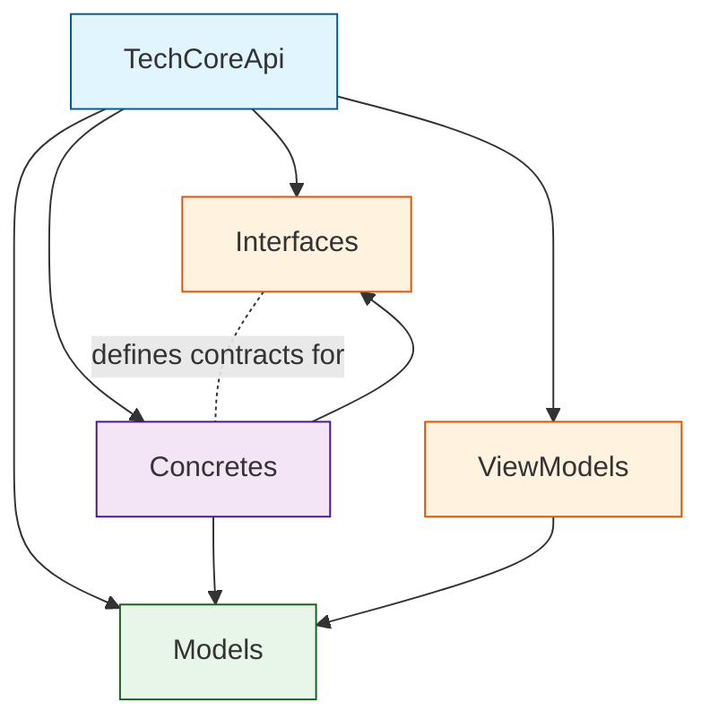
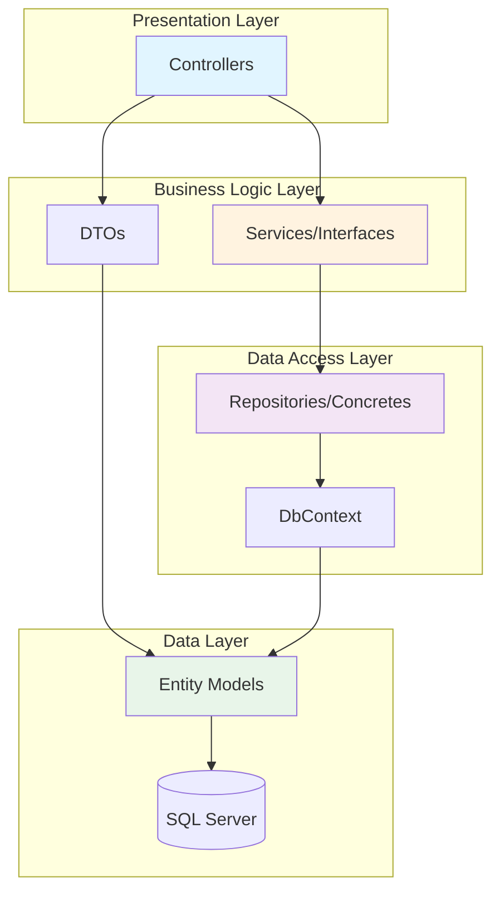
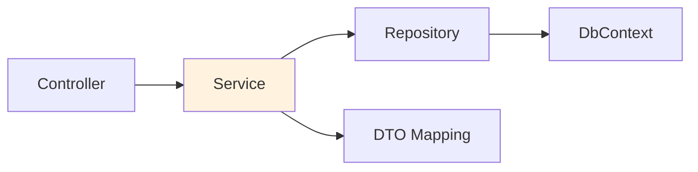

## Solution Structure

TechCore API follows a clean, layered architecture with clear separation of concerns across five distinct projects.

```
TechCore/
├── TechCoreApi/           # 🌐 API Layer (Presentation)
├── Models/                # 📊 Data Models (Entities)
├── Concretes/            # 🔧 Implementation Layer
├── Interfaces/           # 📋 Contract Definitions
├── ViewModels/           # 📦 Data Transfer Objects
└── TechSalesQuery/       # 📄 Database Scripts
```

## Dependency Graph



<Note>
  The API layer depends on all other projects, while lower layers have minimal dependencies.
</Note>

## Layer Responsibilities

### 1. TechCoreApi (Presentation Layer)

<Card title="Primary Responsibility" icon="browser">
  Exposes RESTful API endpoints and handles HTTP requests/responses
</Card>

#### Directory Structure

```
TechCoreApi/
├── Controllers/          # API endpoint controllers
│   └── WeatherForecastController.cs
├── Properties/
│   └── launchSettings.json
├── Program.cs           # Application startup & configuration
├── appsettings.json     # Configuration settings
├── appsettings.Development.json
└── TechSalesApi.csproj  # Project dependencies
```

#### Key Components

<AccordionGroup>
  <Accordion title="Program.cs" icon="gear">
    **Location**: TechCoreApi/Program.cs:1-81
    
    Application entry point and service configuration:
    
    ```csharp
    var builder = WebApplication.CreateBuilder(args);
    
    // Service Registration
    builder.Services.AddControllers();
    builder.Services.AddDbContext<TechSalesContext>(options =>
        options.UseSqlServer(builder.Configuration
            .GetConnectionString("DefaultConnection")));
    
    // API Documentation
    builder.Services.AddOpenApi();
    builder.Services.AddSwaggerGen();
    
    // CORS Configuration
    builder.Services.AddCors(options => {
        options.AddPolicy("MyAllorOrigins", policy =>
            policy.AllowAnyOrigin()
                  .AllowAnyHeader()
                  .AllowAnyMethod());
    });
    
    var app = builder.Build();
    
    // Middleware Pipeline
    app.Use(async (context, next) => {
        if (context.Request.Path == "/")
        {
            context.Response.Redirect("/swagger", permanent: false);
            return;
        }
        await next();
    });
    
    app.UseCors("MyAllorOrigins");
    app.UseHttpsRedirection();
    app.UseAuthorization();
    app.MapControllers();
    app.Run();
    ```
    
    **Key Configurations**:
    - DbContext registration with SQL Server
    - CORS policy for cross-origin requests
    - Swagger UI at root redirect
    - OpenAPI and Scalar documentation
  </Accordion>
  
  <Accordion title="Controllers/" icon="route">
    **Purpose**: Define HTTP endpoints and route requests
    
    **Current Controllers**:
    - `WeatherForecastController.cs` - Sample controller
    
    **Typical Controller Structure**:
    ```csharp
    [ApiController]
    [Route("api/[controller]")]
    public class ProductosController : ControllerBase
    {
        private readonly TechSalesContext _context;
        
        public ProductosController(TechSalesContext context)
        {
            _context = context;
        }
        
        [HttpGet]
        public async Task<ActionResult<IEnumerable<Producto>>> GetProductos()
        {
            return await _context.Productos.ToListAsync();
        }
    }
    ```
  </Accordion>
  
  <Accordion title="appsettings.json" icon="file-code">
    **Purpose**: Application configuration
    
    **Expected Structure**:
    ```json
    {
      "ConnectionStrings": {
        "DefaultConnection": "Server=.;Database=TechCore;..."
      },
      "Logging": {
        "LogLevel": {
          "Default": "Information",
          "Microsoft.AspNetCore": "Warning"
        }
      },
      "AllowedHosts": "*"
    }
    ```
  </Accordion>
</AccordionGroup>

#### Project Dependencies

**File**: TechCoreApi/TechSalesApi.csproj:1-38

<Tabs>
  <Tab title="NuGet Packages">
    ```xml
    <PackageReference Include="Microsoft.AspNetCore.OpenApi" Version="10.0.3" />
    <PackageReference Include="Microsoft.EntityFrameworkCore" Version="10.0.3" />
    <PackageReference Include="Microsoft.EntityFrameworkCore.Design" Version="10.0.3" />
    <PackageReference Include="Microsoft.EntityFrameworkCore.SqlServer" Version="10.0.3" />
    <PackageReference Include="Microsoft.EntityFrameworkCore.Tools" Version="10.0.3" />
    <PackageReference Include="Scalar.AspNetCore" Version="2.12.47" />
    <PackageReference Include="Swashbuckle.AspNetCore.*" Version="10.1.4" />
    ```
  </Tab>
  
  <Tab title="Project References">
    ```xml
    <ProjectReference Include="..\Concretes\Concretes.csproj" />
    <ProjectReference Include="..\Interfaces\Interfaces.csproj" />
    <ProjectReference Include="..\Models\Models.csproj" />
    <ProjectReference Include="..\ViewModels\ViewModels.csproj" />
    ```
  </Tab>
</Tabs>

**Target Framework**: .NET 10.0

---

### 2. Models (Data Layer)

<Card title="Primary Responsibility" icon="database">
  Entity classes representing database tables and views
</Card>

#### Directory Structure

```
Models/
├── Models/              # Entity classes
│   ├── AbonosVenta.cs
│   ├── Categorium.cs
│   ├── Cliente.cs
│   ├── Compra.cs
│   ├── ComprasDetalle.cs
│   ├── PlanPago.cs
│   ├── Producto.cs
│   ├── Proveedore.cs
│   ├── Rol.cs
│   ├── User.cs
│   ├── Venta.cs
│   ├── VentasDetalle.cs
│   ├── VwCuotasPorVencer.cs   # View
│   ├── VwCuotasVencida.cs     # View
│   └── VwEstadoCuentum.cs     # View
└── Models.csproj
```

#### Entity Patterns

All entity classes follow consistent patterns:

<CodeGroup>
```csharp Table Entity
// Table entities have navigation properties
namespace Models.Models;

public partial class Venta
{
    // Primary Key
    public string Norden { get; set; } = null!;
    
    // Foreign Keys
    public string Codclien { get; set; } = null!;
    public int Codvend { get; set; };
    
    // Properties
    public DateTime? Fecha { get; set; }
    public decimal Total { get; set; }
    
    // Navigation Properties (Relationships)
    public virtual Cliente CodclienNavigation { get; set; } = null!;
    public virtual User CodvendNavigation { get; set; } = null!;
    public virtual ICollection<VentasDetalle> VentasDetalles { get; set; }
}
```

```csharp View Entity
// View entities have no navigation properties
namespace Models.Models;

public partial class VwCuotasVencida
{
    // View columns (read-only)
    public string Norden { get; set; } = null!;
    public string Cliente { get; set; } = null!;
    public int DiasAtraso { get; set; }
    public decimal? MoraCalculada { get; set; }
    
    // No navigation properties
}
```
</CodeGroup>

#### Key Characteristics

<Steps>
  <Step title="Partial Classes">
    All entities are `partial class` to allow extension without modifying generated code
  </Step>
  
  <Step title="Nullable Reference Types">
    Uses `= null!` for required properties and `?` for optional
  </Step>
  
  <Step title="Virtual Navigation Properties">
    Navigation properties marked `virtual` for lazy loading support
  </Step>
  
  <Step title="Collection Initialization">
    Collections initialized to empty lists: `= new List<T>()`
  </Step>
</Steps>

#### Entity Categories

<CardGroup cols={2}>
  <Card title="Core Business" icon="briefcase">
    Cliente, Producto, Categorium, Proveedore
  </Card>
  <Card title="Transactions" icon="receipt">
    Venta, VentasDetalle, Compra, ComprasDetalle
  </Card>
  <Card title="Credit Management" icon="credit-card">
    PlanPago, AbonosVenta
  </Card>
  <Card title="System" icon="users">
    User, Rol
  </Card>
  <Card title="Views" icon="eye">
    VwCuotasVencida, VwCuotasPorVencer, VwEstadoCuentum
  </Card>
</CardGroup>

---

### 3. Concretes (Implementation Layer)

<Card title="Primary Responsibility" icon="code">
  Implements business logic, data access, and repository patterns
</Card>

#### Directory Structure

```
Concretes/
├── Data/
│   └── TechSalesContext.cs  # EF Core DbContext
└── Concretes.csproj
```

#### TechSalesContext

**Location**: Concretes/Data/TechSalesContext.cs:8-615

The heart of data access - EF Core DbContext with complete entity configuration.

<Expandable title="DbSet Properties">
  ```csharp
  public partial class TechSalesContext : DbContext
  {
      // Entity Sets (Database Tables)
      public virtual DbSet<AbonosVenta> AbonosVentas { get; set; }
      public virtual DbSet<Categorium> Categoria { get; set; }
      public virtual DbSet<Cliente> Clientes { get; set; }
      public virtual DbSet<Compra> Compras { get; set; }
      public virtual DbSet<ComprasDetalle> ComprasDetalles { get; set; }
      public virtual DbSet<PlanPago> PlanPagos { get; set; }
      public virtual DbSet<Producto> Productos { get; set; }
      public virtual DbSet<Proveedore> Proveedores { get; set; }
      public virtual DbSet<Rol> Rols { get; set; }
      public virtual DbSet<User> Users { get; set; }
      public virtual DbSet<Venta> Ventas { get; set; }
      public virtual DbSet<VentasDetalle> VentasDetalles { get; set; }
      
      // Views
      public virtual DbSet<VwCuotasPorVencer> VwCuotasPorVencers { get; set; }
      public virtual DbSet<VwCuotasVencida> VwCuotasVencidas { get; set; }
      public virtual DbSet<VwEstadoCuentum> VwEstadoCuenta { get; set; }
  }
  ```
</Expandable>

#### OnModelCreating Configuration

Comprehensive Fluent API configuration for each entity:

<AccordionGroup>
  <Accordion title="Primary Keys" icon="key">
    ```csharp
    modelBuilder.Entity<AbonosVenta>(entity =>
    {
        entity.HasKey(e => e.Id)
              .HasName("PK__abonosVe__3213E83F5337B15E");
    });
    ```
  </Accordion>
  
  <Accordion title="Table & Column Mapping" icon="table">
    ```csharp
    entity.ToTable("abonosVentas", tb => tb.HasTrigger("TR_ActualizarSaldo"));
    
    entity.Property(e => e.Id).HasColumnName("id");
    entity.Property(e => e.Monto)
          .HasColumnType("decimal(18, 2)")
          .HasColumnName("monto");
    ```
  </Accordion>
  
  <Accordion title="Indexes" icon="list">
    ```csharp
    entity.HasIndex(e => e.Fecha, "IDX_abonosVentas_fecha");
    entity.HasIndex(e => e.Norden, "IDX_abonosVentas_norden");
    
    // Filtered index
    entity.HasIndex(e => e.Pagada, "IDX_planPagos_pagada")
          .HasFilter("([pagada]=(0))");
    
    // Unique index
    entity.HasIndex(e => e.Codigo, "UQ__categori__40F9A206C88944E2")
          .IsUnique();
    ```
  </Accordion>
  
  <Accordion title="Default Values" icon="circle-check">
    ```csharp
    entity.Property(e => e.Fecha)
          .HasDefaultValueSql("(getdate())")
          .HasColumnType("datetime");
          
    entity.Property(e => e.Estado)
          .HasDefaultValue(true);
          
    entity.Property(e => e.TasaInteres)
          .HasDefaultValue(0m)
          .HasColumnType("decimal(5, 2)");
    ```
  </Accordion>
  
  <Accordion title="Relationships" icon="link">
    ```csharp
    // Many-to-One
    entity.HasOne(d => d.NordenNavigation)
          .WithMany(p => p.AbonosVenta)
          .HasForeignKey(d => d.Norden)
          .HasConstraintName("FK__abonosVen__norde__7F2BE32F");
    
    // With Delete Behavior
    entity.HasOne(d => d.CodprodNavigation)
          .WithMany(p => p.VentasDetalles)
          .HasForeignKey(d => d.Codprod)
          .OnDelete(DeleteBehavior.ClientSetNull)
          .HasConstraintName("FK__ventasDet__codpr__6E01572D");
    
    // Cascade Delete
    entity.HasOne(d => d.NordenNavigation)
          .WithMany(p => p.VentasDetalles)
          .HasForeignKey(d => d.Norden)
          .OnDelete(DeleteBehavior.Cascade)  // ON DELETE CASCADE
          .HasConstraintName("FK__ventasDet__norde__6D0D32F4");
    ```
  </Accordion>
  
  <Accordion title="Database Views" icon="eye">
    ```csharp
    modelBuilder.Entity<VwCuotasVencida>(entity =>
    {
        entity.HasNoKey()  // Views don't have primary keys
              .ToView("vw_CuotasVencidas");
        
        entity.Property(e => e.Cliente)
              .HasMaxLength(200)
              .IsUnicode(false)
              .HasColumnName("cliente");
    });
    ```
  </Accordion>
</AccordionGroup>

#### Namespace

```csharp
namespace Models.Data;  // Note: Uses Models namespace, not Concretes
```

<Note>
  The DbContext is in the `Models.Data` namespace despite being in the Concretes project, maintaining logical grouping with entity models.
</Note>

---

### 4. Interfaces (Contract Layer)

<Card title="Primary Responsibility" icon="handshake">
  Defines service contracts and repository interfaces for dependency injection
</Card>

#### Directory Structure

```
Interfaces/
└── Interfaces.csproj
```

<Warning>
  Currently empty - interfaces should be added as repository and service patterns are implemented.
</Warning>

#### Recommended Structure

<Expandable title="Typical Interface Organization">
  ```
  Interfaces/
  ├── Repositories/
  │   ├── IRepository.cs           # Generic repository
  │   ├── IClienteRepository.cs
  │   ├── IProductoRepository.cs
  │   ├── IVentaRepository.cs
  │   └── ICompraRepository.cs
  ├── Services/
  │   ├── IClienteService.cs
  │   ├── IProductoService.cs
  │   ├── IVentaService.cs
  │   └── IAuthService.cs
  └── Interfaces.csproj
  ```
</Expandable>

#### Example Interface Pattern

<CodeGroup>
```csharp Generic Repository
public interface IRepository<T> where T : class
{
    Task<IEnumerable<T>> GetAllAsync();
    Task<T?> GetByIdAsync(object id);
    Task<T> AddAsync(T entity);
    Task UpdateAsync(T entity);
    Task DeleteAsync(object id);
    Task<bool> ExistsAsync(object id);
}
```

```csharp Specific Repository
public interface IVentaRepository : IRepository<Venta>
{
    Task<IEnumerable<Venta>> GetVentasByClienteAsync(string codCliente);
    Task<IEnumerable<Venta>> GetVentasByCreditoAsync();
    Task<decimal> GetSaldoTotalAsync(string norden);
    Task AnularVentaAsync(string norden);
}
```

```csharp Service Interface
public interface IVentaService
{
    Task<VentaResponseDto> CreateVentaAsync(CreateVentaDto dto);
    Task<VentaResponseDto> GetVentaAsync(string norden);
    Task<IEnumerable<VentaResponseDto>> GetVentasByClienteAsync(string codCliente);
    Task AnularVentaAsync(string norden);
    Task<decimal> CalcularSaldoAsync(string norden);
}
```
</CodeGroup>

---

### 5. ViewModels (DTO Layer)

<Card title="Primary Responsibility" icon="box">
  Data Transfer Objects for API requests and responses
</Card>

#### Directory Structure

```
ViewModels/
├── Class1.cs            # Placeholder file
└── ViewModels.csproj
```

<Warning>
  Currently minimal - DTOs should be added as API endpoints are developed.
</Warning>

#### Recommended Structure

<Expandable title="Typical ViewModel Organization">
  ```
  ViewModels/
  ├── Requests/
  │   ├── CreateVentaDto.cs
  │   ├── UpdateProductoDto.cs
  │   ├── CreateClienteDto.cs
  │   └── LoginDto.cs
  ├── Responses/
  │   ├── VentaResponseDto.cs
  │   ├── ProductoResponseDto.cs
  │   ├── ClienteResponseDto.cs
  │   └── AuthResponseDto.cs
  ├── Common/
  │   ├── PagedResultDto.cs
  │   ├── ErrorResponseDto.cs
  │   └── ValidationErrorDto.cs
  └── ViewModels.csproj
  ```
</Expandable>

#### DTO Patterns

<Tabs>
  <Tab title="Request DTOs">
    ```csharp
    public class CreateVentaDto
    {
        [Required]
        public string CodCliente { get; set; } = null!;
        
        [Required]
        public string TipoPago { get; set; } = "CONTADO";
        
        public int? Meses { get; set; }
        
        public decimal? TasaInteres { get; set; }
        
        [Required]
        public List<VentaDetalleDto> Detalles { get; set; } = new();
    }
    
    public class VentaDetalleDto
    {
        [Required]
        public string CodProducto { get; set; } = null!;
        
        [Range(1, int.MaxValue)]
        public int Cantidad { get; set; }
        
        [Range(0.01, double.MaxValue)]
        public decimal Precio { get; set; }
    }
    ```
  </Tab>
  
  <Tab title="Response DTOs">
    ```csharp
    public class VentaResponseDto
    {
        public string Norden { get; set; } = null!;
        public DateTime Fecha { get; set; }
        public string Cliente { get; set; } = null!;
        public string Vendedor { get; set; } = null!;
        public decimal Subtotal { get; set; }
        public decimal Iva { get; set; }
        public decimal Total { get; set; }
        public string TipoPago { get; set; } = null!;
        public decimal Saldo { get; set; }
        public List<VentaDetalleResponseDto> Detalles { get; set; } = new();
    }
    
    public class VentaDetalleResponseDto
    {
        public string Producto { get; set; } = null!;
        public int Cantidad { get; set; }
        public decimal PrecioUnitario { get; set; }
        public decimal Subtotal { get; set; }
    }
    ```
  </Tab>
  
  <Tab title="Common DTOs">
    ```csharp
    public class PagedResultDto<T>
    {
        public List<T> Items { get; set; } = new();
        public int TotalCount { get; set; }
        public int Page { get; set; }
        public int PageSize { get; set; }
        public int TotalPages => (int)Math.Ceiling(TotalCount / (double)PageSize);
    }
    
    public class ErrorResponseDto
    {
        public string Message { get; set; } = null!;
        public string? Details { get; set; }
        public List<ValidationErrorDto>? ValidationErrors { get; set; }
    }
    
    public class ValidationErrorDto
    {
        public string Field { get; set; } = null!;
        public string Message { get; set; } = null!;
    }
    ```
  </Tab>
</Tabs>

---

### 6. TechSalesQuery (Database Scripts)

<Card title="Primary Responsibility" icon="file-code">
  SQL scripts for database creation and initialization
</Card>

#### Contents

```
TechSalesQuery/
└── TechSalesQuery.sql   # Complete database schema
```

**File Location**: TechSalesQuery/TechSalesQuery.sql:1-436

<Expandable title="Script Sections">
  1. **Database Creation** (Lines 1-5)
  2. **Table Definitions** (Lines 7-213)
     - rol, users, clientes, categoria, proveedores
     - productos, ventas, ventasDetalle
     - compras, comprasDetalle
     - planPagos, abonosVentas
  3. **Indexes** (Lines 215-333)
     - Standard indexes
     - Unique indexes
     - Filtered indexes
     - Composite indexes
  4. **Triggers** (Lines 335-374)
     - TR_DisminuirStock
     - TR_ActualizarSaldo
  5. **Views** (Lines 376-436)
     - vw_CuotasVencidas
     - vw_CuotasPorVencer
     - vw_EstadoCuenta
</Expandable>

<Note>
  This script was used to generate the database. The EF Core models were then scaffolded from this database using `Scaffold-DbContext`.
</Note>

---

## Architectural Patterns

### Layered Architecture



### Repository Pattern (Recommended)

<Steps>
  <Step title="Define Interface">
    Create interface in `Interfaces/Repositories/`
  </Step>
  
  <Step title="Implement in Concretes">
    Create concrete implementation in `Concretes/Repositories/`
  </Step>
  
  <Step title="Register in DI Container">
    Register in `Program.cs`:
    ```csharp
    builder.Services.AddScoped<IVentaRepository, VentaRepository>();
    ```
  </Step>
  
  <Step title="Inject into Controllers">
    ```csharp
    public class VentasController : ControllerBase
    {
        private readonly IVentaRepository _ventaRepo;
        
        public VentasController(IVentaRepository ventaRepo)
        {
            _ventaRepo = ventaRepo;
        }
    }
    ```
  </Step>
</Steps>

### Service Layer Pattern (Recommended)



**Benefits**:
- Business logic separated from data access
- DTO mapping isolated from controllers
- Transaction management centralized
- Easier unit testing

---

## Coding Conventions

### Namespace Organization

<CodeGroup>
```csharp API Layer
namespace TechCoreApi.Controllers;
using Models.Models;
using Models.Data;
```

```csharp Models
namespace Models.Models;  // Entity classes
namespace Models.Data;    // DbContext
```

```csharp Concretes
namespace Concretes.Repositories;
namespace Concretes.Services;
using Models.Models;
using Models.Data;
```

```csharp Interfaces
namespace Interfaces.Repositories;
namespace Interfaces.Services;
```

```csharp ViewModels
namespace ViewModels.Requests;
namespace ViewModels.Responses;
namespace ViewModels.Common;
```
</CodeGroup>

### File Naming

<Tabs>
  <Tab title="Entities">
    - Singular nouns: `Cliente.cs`, `Producto.cs`, `Venta.cs`
    - Match database table names (scaffold preserves this)
  </Tab>
  
  <Tab title="Controllers">
    - Plural + Controller: `ClientesController.cs`, `VentasController.cs`
  </Tab>
  
  <Tab title="Repositories">
    - Interface: `IClienteRepository.cs`
    - Implementation: `ClienteRepository.cs`
  </Tab>
  
  <Tab title="Services">
    - Interface: `IVentaService.cs`
    - Implementation: `VentaService.cs`
  </Tab>
  
  <Tab title="DTOs">
    - Request: `CreateVentaDto.cs`, `UpdateClienteDto.cs`
    - Response: `VentaResponseDto.cs`, `ClienteResponseDto.cs`
  </Tab>
</Tabs>

---

## Build Configuration

### Target Framework

All projects target **.NET 10.0**:

```xml
<TargetFramework>net10.0</TargetFramework>
```

### Common Settings

```xml
<PropertyGroup>
  <TargetFramework>net10.0</TargetFramework>
  <Nullable>enable</Nullable>
  <ImplicitUsings>enable</ImplicitUsings>
</PropertyGroup>
```

### Project References Flow

```
TechCoreApi
├─→ Concretes
├─→ Interfaces
├─→ Models
└─→ ViewModels

Concretes
├─→ Interfaces
└─→ Models

ViewModels
└─→ Models
```

---

## Development Workflow

### Adding New Entities

<Steps>
  <Step title="Update Database">
    Add table to SQL Server using migration script
  </Step>
  
  <Step title="Scaffold Entity">
    ```bash
    Scaffold-DbContext "ConnectionString" \
        Microsoft.EntityFrameworkCore.SqlServer \
        -OutputDir Models \
        -Context TechSalesContext \
        -ContextDir Data \
        -Force
    ```
  </Step>
  
  <Step title="Create DTOs">
    Add request/response DTOs in ViewModels project
  </Step>
  
  <Step title="Create Repository">
    Add interface in Interfaces, implementation in Concretes
  </Step>
  
  <Step title="Create Controller">
    Add controller in TechCoreApi/Controllers
  </Step>
</Steps>

### Adding New Features

<Steps>
  <Step title="Define Interface">
    Create service interface in Interfaces project
  </Step>
  
  <Step title="Implement Service">
    Create implementation in Concretes project
  </Step>
  
  <Step title="Register Service">
    Add to DI container in Program.cs
  </Step>
  
  <Step title="Create Controller Actions">
    Add endpoints to appropriate controller
  </Step>
  
  <Step title="Test with Swagger">
    Navigate to `/swagger` and test endpoints
  </Step>
</Steps>

---

## Next Steps

<CardGroup cols={2}>
  <Card title="System Architecture" icon="sitemap" href="/architecture/overview">
    Review high-level architecture and design patterns
  </Card>
  <Card title="Data Models" icon="database" href="/architecture/data-models">
    Explore entity relationships and database schema
  </Card>
</CardGroup>

<Tip>
  Consider implementing repository and service layers in the Interfaces/Concretes projects to follow clean architecture principles.
</Tip>
